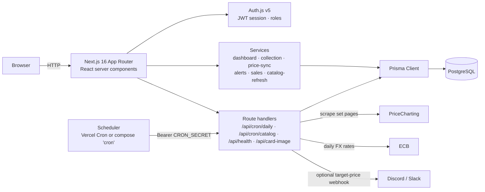

# One Piece TCG Tracker

A self-hosted, invite-only web app for tracking a **One Piece TCG collection** and its market
value. It keeps a shared catalog of rare Japanese cards, tracks prices in three grades
(**Raw · PSA 9 · PSA 10**) in **EUR**, and charts their price history over time.

Built as a private tool for a handful of collectors (owner + invited friends) — not a commercial
product. Every user has their own collection and watchlist; the card catalog and price data are
shared.

> **Where to start**
> - Want to run it? → **[SETUP.md](./SETUP.md)**
> - Self-hosting on a Raspberry Pi with Docker → **[docs/self-hosting-pi.md](./docs/self-hosting-pi.md)**
> - Design specs & plans → [`docs/superpowers/`](./docs/superpowers/)

---

## Screenshots

<!-- TODO(owner): add real screenshots, e.g. docs/screenshots/dashboard.png · card-detail.png · gallery.png -->

| Dashboard | Card detail | Gallery |
| --- | --- | --- |
| _(screenshot pending)_ | _(screenshot pending)_ | _(screenshot pending)_ |

**Live demo:** _not publicly available_ — the app is invite-only by design (there is no public
sign-up). A short recorded walkthrough is planned; drop the link here once it exists.

---

## Features

- **Invite-only multi-user auth** — Auth.js (NextAuth) credentials login, bcrypt-hashed passwords,
  `owner` / `friend` roles. Registration requires a valid, unused invite code.
- **Per-user collection** — cards with grade, quantity, purchase price/currency/date, condition and
  notes. Every query is scoped to the signed-in user, so users never see each other's holdings.
- **Dashboard** — total collection value (Raw / PSA 9 / PSA 10), value history chart with a
  30/90/365-day range toggle, 30-day change badge, top movers, counts and breakdowns.
- **Card detail page** — 3-series price chart (Raw · PSA 9 · PSA 10), per-grade 30-day deltas,
  all-time high/low, "my holding" with purchase price → current value → P/L, and a watch toggle.
- **Gallery / catalog browser** — shared catalog with card artwork, a landing page grouped by set
  and category, rarity filter chips, text search over name and card number, and sorting by name or
  price.
- **Watchlist** — per-user list of cards to keep an eye on.
- **Price alerts** — set a target price per watched card and grade. The price sync fires exactly
  once when the price crosses below the target (re-arming only after a recovery, so a card that
  stays cheap does not spam you), surfaces the hits on the dashboard and watchlist, and can push
  them to a Discord/Slack webhook via `ALERT_WEBHOOK_URL`.
- **Sale tracking with realized P/L** — record a sale per holding (price per unit, fees, date). The
  holding is reduced or removed in the same transaction, the purchase price is kept as the sale's
  cost basis, and both the per-sale and total realized profit are shown on `/sales`.
- **Automated price sync** — a scheduled job pulls raw / grade-9 / PSA-10 prices, converts them to
  EUR using ECB reference rates, and writes one idempotent snapshot per card, grade and day.
- **Automatic catalog refresh** — a weekly job imports the new Japanese sets with the artwork that
  matches each variant, so fresh releases show up without any manual import.
- **Self-hostable** — a full Docker Compose stack (Postgres + migrations + app + cron) runs the
  whole thing on a Raspberry Pi with no Node.js on the host.
- **Accessibility & polish** — keyboard-friendly forms, labelled inputs, `prefers-reduced-motion`
  support, and a dark "Vault" design system (anthracite + gold) built on custom design tokens.

## Tech stack

| Layer | Choice |
| --- | --- |
| Framework | Next.js 16 (App Router, React 19, TypeScript, `standalone` output) |
| Styling | Tailwind CSS v4 with a custom "Vault" design-token theme |
| Database | PostgreSQL via Prisma ORM (migrations in `prisma/migrations/`) |
| Auth | Auth.js / NextAuth v5 (credentials provider, JWT sessions, bcrypt) |
| Charts | Recharts |
| Validation | Zod |
| Tests | Vitest + Testing Library — pure-module unit tests plus DB-backed integration suites |
| CI | GitHub Actions — lint, unit tests and a production build, plus an integration job on a Postgres 16 service |
| Hosting | Vercel + Neon (cloud) **or** Docker Compose on a Raspberry Pi |

## Architecture



**Layers**

- `src/app/` — pages (App Router), server actions and API route handlers.
- `src/services/` — use cases: dashboard aggregation, collection, price sync, alerts, sales and the
  catalog refresh.
- `src/domain/` — pure, unit-tested logic (trackability rules, FX conversion, money parsing and
  formatting, alert crossing rules, realized P/L, catalog/console parsing, invite validation).
- `src/lib/providers/` — outbound data adapters (PriceCharting pages + API, eBay sold listings,
  ECB FX).
- `prisma/` — schema and migrations; `scripts/` — one-off maintenance and import jobs.

### Data model (short version)

| Shared (global) | Per user |
| --- | --- |
| `Card` (catalog), `PriceSnapshot` (daily resolved price per grade), `SaleObservation` (market sales), `FxRate`, `SyncRun` (job log) | `CollectionItem`, `WatchlistItem`, `PriceAlert` (fired target-price hits), `Sale` (recorded sales with cost basis) |

Every price snapshot stores the native price and its currency, the EUR value **and** the FX rate
used — so historical values stay reproducible even when rates move.

### Design decisions worth calling out

- **A trackability rule instead of a hard-coded card list.** `isTrackable(card)`
  (`src/domain/card.ts`) is a pure function: Japanese cards are tracked when their rarity
  (SR / SEC / SP / L) or variant (alt-art, manga, parallel, serial) is special, or when they are
  promos / collab cards. Bulk C / UC / R stays out of the catalog. A per-card `trackOverride`
  allows manual exceptions.
- **One canonical import path.** `classifyPcCard` decides what a scraped product *is* (number →
  set/category, variant, rarity) and `refreshCatalog` is the only writer, so the scheduled refresh
  and `npm run job:catalog` cannot drift apart. Images follow the same rule: the official
  per-number art is used where it applies, and a per-variant provider image is stored exactly when
  the official art would be wrong or missing.
- **Provider abstraction with a resolver.** Price sources implement one `PriceProvider` interface;
  a `PriceResolver` picks the best candidate per card/grade and records its provenance, so sources
  can be added or swapped without touching domain logic.
- **Idempotent, per-day snapshots.** Repeated sync runs on the same day update the same rows
  (`@@unique([cardId, grade, date])`), which keeps charts a straightforward query and makes retries
  safe.
- **Alerts that do not spam.** `isAlertTriggered` (`src/domain/alerts.ts`) is a pure rule — armed
  above the target, fires on the way down — and `@@unique([userId, cardId, grade, snapshotDate])`
  makes the evaluation idempotent, so re-running the sync the same day cannot duplicate a hit.
- **Money that stays honest.** `realizedPnl` (`src/domain/sale.ts`) reports *null* P/L when the
  purchase price is unknown instead of guessing a cost, and `recordSale` decrements the holding
  relatively inside the transaction so two submits compose instead of overwriting each other.
- **Per-user isolation by construction.** Role/session helpers gate access and every collection,
  watchlist, alert and sale query filters on `userId`; integration tests cover the isolation cases.
- **No public surface.** Middleware (`src/proxy.ts`) keeps every page behind login except `/login`
  and `/register`, and the scheduled endpoints run through one constant-time bearer check
  (`src/lib/cron-auth.ts`) where an unset `CRON_SECRET` authorises nothing.

## Project structure

```
src/
  app/            # pages, server actions, API routes (/api/cron/*, /api/health, /api/card-image)
  components/     # AppShell, cards, charts + a small UI kit (ui/)
  domain/         # pure business logic, each module with a co-located *.test.ts
  lib/            # db client, session helpers, cron auth, providers/ (PriceCharting, eBay, ECB)
  services/       # application use cases (dashboard, collection, price-sync, alerts, sales, catalog)
prisma/           # schema.prisma + migrations
scripts/          # seed + one-off import/normalization jobs (see SETUP.md)
docs/             # design specs, plans and the Raspberry Pi self-hosting guide
```

## Getting started (short version)

```bash
git clone https://github.com/PsychzZ/op-tcg-tracker.git
cd op-tcg-tracker
npm ci
cp .env.example .env    # fill in DATABASE_URL, AUTH_SECRET, OWNER_* — see SETUP.md
npm run db:migrate      # create the schema
npm run seed:owner      # create your owner account from OWNER_EMAIL / OWNER_PASSWORD
npm run dev             # http://localhost:3000
```

Full walkthrough — environment variables, catalog imports, Docker/Pi stack and cloud deployment:
**[SETUP.md](./SETUP.md)**.

## Tests

```bash
npm test          # unit tests, no database required
npm run test:int  # integration tests against a migrated dev database (*.itest.ts)
npm run lint      # eslint
npm run build     # next build (also type-checks)
```

Domain logic lives in small pure modules with co-located tests; anything touching the database or
the authorization rules is covered by the integration suites instead (`collection`, `alerts`,
`sales`, `catalog-refresh`). CI (`.github/workflows/ci.yml`) runs both — the integration job against
a throwaway Postgres 16 service with all migrations applied.

## Status & roadmap

Shipped: auth + invites, catalog, collection CRUD, dashboard, gallery, card detail, watchlist,
target-price alerts with an optional webhook, sale tracking with realized P/L, scheduled price sync
in EUR, automatic weekly catalog refresh, Japanese names via `npm run fill:names`, CI, Docker/Pi
self-hosting. Still open (see
[`docs/superpowers/PHASE2-backlog.md`](./docs/superpowers/PHASE2-backlog.md)): a "recent sales" list
on card detail, profile/password page, owner sync-status view, CSV import/export and better coverage
for rare Japanese cards. Note the Japanese-name fill is a manual step (or your own cron) — it matches
the official card list by card number and writes the name the gallery's search field matches.

## License

Private, non-commercial project. No license is granted for reuse or redistribution; the repository
is public for portfolio and review purposes.
